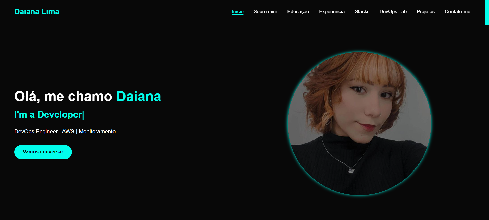

# Portfólio Pessoal

Bem-vindo ao repositório do meu portfólio! Este projeto foi desenvolvido para apresentar minhas habilidades, experiências, projetos e tecnologias que domino.

## ✨ Demonstração

Acesse o portfólio online: [Em Processo](https://seu-link.com)

## 📋 Descrição

Este portfólio foi criado com foco em responsividade, design moderno e performance. Ele apresenta:

- **Seção Sobre Mim:** Breve apresentação e trajetória.
- **Educação:** Formação acadêmica e cursos relevantes.
- **Experiência Profissional:** Linha do tempo com experiências e conquistas.
- **Stacks:** Principais tecnologias e ferramentas utilizadas.
- **Projetos:** Galeria de projetos com descrição e tecnologias empregadas.
- **DevOps Lab:** Experimentos e estudos em DevOps.
- **Contato:** Redes sociais e formas de contato.

## 🛠️ Tecnologias Utilizadas

- **HTML5**
- **CSS3** (com foco em Flexbox, Grid e responsividade)
- **JavaScript**

## 📱 Responsividade

O layout é totalmente responsivo, adaptando-se a diferentes tamanhos de tela (desktop, tablet e mobile).

## 🚀 Como rodar localmente

1. Clone este repositório:
   ```bash
   git clone https://github.com/Daian4/portfolio.git
   ```
2. Acesse a pasta do projeto:
   ```bash
   cd portfolio
   ```
3. Abra o arquivo `index.html` no seu navegador.

> **Obs:** Não é necessário backend ou instalação de dependências para rodar este portfólio.

## 📂 Estrutura de Pastas

```
/
├── index.html
├── style.css
├── /assets
└── README.md
```

## 🖼️ Screenshots



## 📬 Contato

- [LinkedIn](https://www.linkedin.com/in/daiana-lima-dev/)
- [E-mail](mailto:daianalimaep@@email.com)
